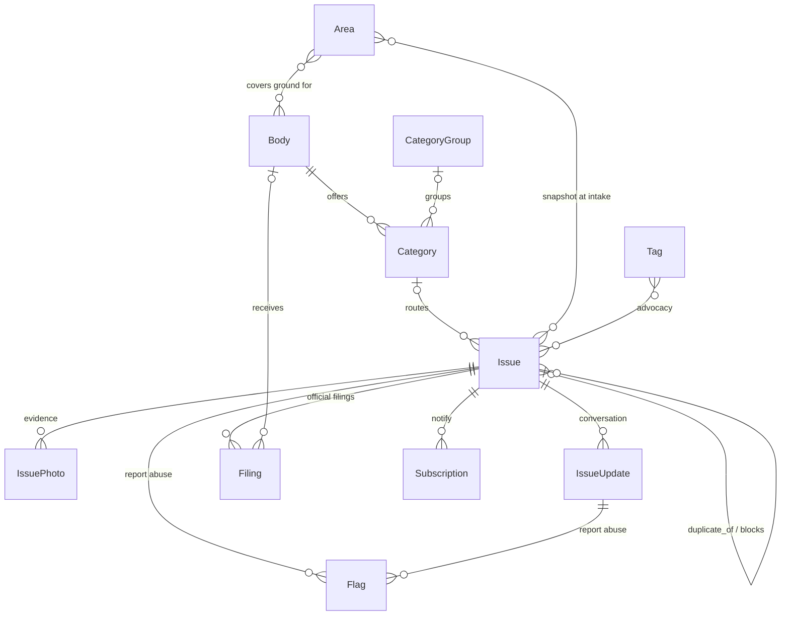

# How PleaseFix works — developer walkthrough

The architecture, a report's journey through the code, and every table
in the data model — each with the *why*, not just the *what*.

> **Prefer the interactive version.** This page mirrors
> [`site/dev.html`](../site/dev.html) — on any running instance it's at
> `/site/dev.html` (linked from every page footer), with a clickable
> architecture map, a step-through of the report journey, and a
> cross-linked model explorer. This markdown version exists so the same
> content reads well here on GitHub.
>
> **Maintained artifact:** `core/tests/test_dev_site.py` fails CI when a
> core model is missing from this file or from `site/dev.html`. Change
> the domain model → update both in the same PR.

Related: [DESIGN.md](DESIGN.md) (decisions + rationale) ·
[CONTRIBUTING](../CONTRIBUTING.md) (culture, first-PR guide) ·
[good first issues](GOOD_FIRST_ISSUES.md) ·
[role tracks](TRACKS.md)

## 1 · The moving parts

One `docker compose up` is the whole stack — dev and production have
the same shape.

| Service | What / why |
|---|---|
| **Caddy** (`:80/:443`) | Reverse proxy with automatic TLS. Serves the map's PMTiles as a static file and proxies the S3 route (aws-chunked uploads through naive proxies fail with `SignatureDoesNotMatch`). |
| **app** — Django 5 + HTMX (`:8000`) | The reference client and the API in one process: server-rendered templates (vendored HTMX, no npm) and django-ninja under `/api/v1/`. Strict mypy, GeoDjango. Dev runs the fail-fast runserver; production runs gunicorn. |
| **worker** — Celery | Background jobs: notifications, image processing, dispatch. Same image as app, different command. |
| **db** — PostgreSQL + PostGIS (`:5432`) | The single database. Point-in-polygon routing ("which council covers this pothole?") is a WHERE clause, not a service. |
| **redis** (`:6379`) | Celery broker + shared cache. Abuse throttles live here — per-process caching would make rate limits ineffective across workers, which is why production refuses to boot without `REDIS_URL`. |
| **versitygw** — S3 (`:7070`) | Bundled S3 gateway (Apache-2.0) with a posix backend: photos are plain files on disk — rsync-able, recoverable without the gateway. The app speaks only dumb S3. |

## 2 · A report's journey

Follow one pothole from a citizen's browser to a public,
agency-tracked record.

1. **A citizen hits `/report/`** (`core/views.py`) — the web form is
   just an inbound channel; GET parameters prefill it, which is how the
   bookmarklet and the PWA share-target import complaints straight from
   social media.
2. **Abuse checks, no login** (`core/abuse.py`) — a honeypot silently
   drops bots, per-IP throttles use **salted IP hashes** (raw IPs are
   never stored — PDPA). Spam that gets through is handled by community
   flags later, not login friction here.
3. **`Issue.objects.create_report()` — the only way issues are born**
   (`core/models.py`) — allocates the public ID (`PF-k7xq2mv`, random,
   no enumeration), hashes the claim token, and **snapshots the areas
   covering the point** (boundaries get redrawn; history must not).
4. **Routing: point → areas → bodies → categories** —
   `Category.objects.for_point(location)` returns the union of
   categories from *every* active body covering the point. Overlap — a
   Pihak Berkuasa Tempatan (PBT, the local council), Jabatan Kerja Raya
   (JKR, the Public Works Department), and Tenaga Nasional Berhad (TNB,
   the electricity utility) all at one spot — is the normal case. Zero
   matches is accepted and marked, never rejected.
5. **The claim token — shown once, never stored** — a one-time reporter
   secret (only its salted hash is kept). It proves "I am the original
   reporter" on follow-ups and later claims the report into an account.
   Identity is progressive: **the report comes first.** Claimed reports
   are harder to flag-bomb (threshold 5 vs 3).
6. **Public means `public()`** — every list, map, page, and API response
   goes through `Issue.objects.public()`, which excludes hidden
   (moderated), unconfirmed, and non-public issues *at the database*.
   There is no second visibility code path to forget.
7. **The conversation: updates, flags, auto-hide** (`core/views.py`) —
   anyone can add a follow-up or flag abuse; flags are deduped per
   submitter, and enough distinct flags **hide (never delete)** content
   pending review. An update can carry the status transition it caused,
   so state changes are public, attributed record entries.
8. **Filings: the community record vs agency tickets** — each official
   complaint is a `Filing`, one per (issue, body), many per issue. The
   agency closing its ticket updates **that filing only**; the issue
   stays open until the problem is actually fixed — that is the whole
   point of the platform (see [WHY.md](WHY.md)).
9. **The same story via the API** (`api/v1.py`) — `/api/v1/issues`
   serves identical `public()` data; the OpenAPI schema
   (`api/openapi.json`) is a reviewed artifact — CI fails if the API
   surface changes without the schema diff being committed.

## 3 · The data model

Everything lives in [`core/models.py`](../core/models.py) (one file, on
purpose — it *is* the domain). Invariants are DB constraints backed by
tripwire tests in `core/tests/test_domain_model.py`.



### Routing (jurisdictions are data, not code)

| Model | Why it exists |
|---|---|
| **Area** | An administrative boundary (state / district / council area). Point → areas → bodies is how reports find their agencies. Boundaries get redrawn, so rows are versioned: redraws bump a `generation` and deactivate old rows — historical issues keep their snapshot. |
| **Body** | An agency: a Pihak Berkuasa Tempatan (PBT — local council), Jabatan Kerja Raya (JKR — Public Works), Tenaga Nasional Berhad (TNB — electricity), Prasarana (public transport)… `dispatch_email` is the delivery floor; categories can override it. |
| **CategoryGroup** | Two-level dropdown — Malaysian local-council complaint taxonomies are large; a flat list dies at ~30 entries. |
| **Category** | A **per-body join, not a global taxonomy** — unique on (body, name). The reporter sees the union across all bodies covering their point. Flags: `photo_required`, `non_public`, `prefer_if_multiple`, `sispaa_category` (mapping into SISPAA, the government's public-complaint system), `extra_fields` (typed extra-questions schema). Unconfirmed categories hold dispatch; soft-delete only. |
| **Tag** | Free-form community tags (a11y, CEDAW, public-transport) — the advocacy/discovery axis, deliberately separate from routed categories. |

### The report

| Model | Why it exists |
|---|---|
| **Issue** | The community's record, not any agency's ticket. Status is a small closed set in code (open/fixed/closed — invariants run on these) qualified by `closure_reason` and `fixed_source` ("agency says fixed, community says not" is core data). `duplicate_of` is a real FK. `confirmed_at` enables report-first-verify-later. Per-act `anonymous` is display-only (staff still see the name). Intake snapshots `source_channel`, `language`, `address`, covering `areas`. `claim_token_hash`/`owner` implement progressive identity. |
| **IssuePhoto** | Dated photos are the evidence trail — the accountability instrument official channels don't keep public. |
| **IssueUpdate** | The public conversation. `new_status` records the transition an update caused — staff and verified-reporter state changes become public, attributed audit entries. `by_reporter` is verified via the reporter secret or owning account. |
| **IssueLink** | Blocks/blocked-by between issues. "I can't walk from A to B" is blocked by "no crossing at Y" and "lights out at Z" — each possibly a different agency. Government systems can't represent this; we can. |

### Accountability

| Model | Why it exists |
|---|---|
| **Filing** | One official filing with one body — many per issue. Carries the agency's reference number and *their* status; once dispatched, the agency system is system-of-record **for that filing only** — a filing closing never auto-closes the issue. Also records community-filed complaints, including free-text targets ("local councillor"). |
| **Flag** | "Report abuse" by anyone, no login. Deduped per submitter (salted IP hash, DB constraint); enough distinct flags auto-hide pending review — hidden, never deleted. Verified content needs 5 flags instead of 3: identity buys abuse resistance. |
| **Subscription** | "Tell me when this changes." Schema is generic now (issue-follow; area alerts via `params`) because retrofitting the entity under a live notification system is the expensive direction. |

## 4 · The dev loop

```sh
# once
cp .env.example .env        # settings refuse to boot without env
uv sync
docker compose up -d db     # PostGIS (or the full stack: docker compose up)
uv run python manage.py migrate && uv run python manage.py seed_sample_data
uv run python manage.py runserver   # fails fast if migrations are pending

# before every commit (this is CI, in order)
uv run python manage.py compilemessages
uv run ruff check . && uv run ruff format --check .
uv run mypy .
uv run lint-imports
uv run pytest
uv run python manage.py export_openapi_schema && git diff --exit-code api/openapi.json
uv run python manage.py export_good_first_issues && git diff --exit-code site/good-first-issues.html
```

Rules that bite (protected core, no new deps, i18n-from-day-one) are in
[AGENTS.md](../AGENTS.md) — they apply to humans and AI agents alike.

## 5 · Lost? Start here

**The culture is stone soup** — informal development, hack and have
fun, no grand roadmap, scratch your own itch, one-line code of conduct.
The parable and the practical version are in
[CONTRIBUTING.md](../CONTRIBUTING.md#the-culture-stone-soup).

- [Good first issues](GOOD_FIRST_ISSUES.md) — small, curated starter
  tasks, each naming the files you'll touch and how to know you're done.
- [Role tracks](TRACKS.md) — frontend, backend, or AI/integrations,
  each with a 10-minute setup and a first-change walkthrough.
- Or ignore both and build a client against the API
  ([CONTRIBUTING](../CONTRIBUTING.md#build-a-client-instead)) — that's
  the stone-soup move.

### Glossary

Malaysian civic terms you'll meet in the code and docs:

- **PBT** — *Pihak Berkuasa Tempatan*, a local authority/council
  (e.g. Majlis Bandaraya Petaling Jaya, MBPJ). The default owner of
  potholes, drains, and streetlights.
- **JKR** — *Jabatan Kerja Raya*, the Public Works Department.
- **TNB** — *Tenaga Nasional Berhad*, the national electricity utility.
- **SISPAA** — *Sistem Pengurusan Aduan Awam*, the government's official
  public-complaint system.
- **Prasarana** — the state-owned public-transport operator (LRT —
  light rail transit, monorail, buses).
- **aduan** — Bahasa Melayu for "complaint"; **selesai** — "resolved".
